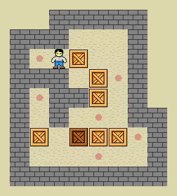

# Sokoban ai

This repository is to make the deep learnign based AI for sokoban env

The env setup will be based on the ai based environment

# Things to do:
- [x] get the state of the all the boxes and worker
- [x] get weight euclidian, manhattan, etc
- [ ] write the A star function for baseline measurement
- [ ] write DQN algorithm
- [ ] write DDQN algorithm
- [ ] write DDPG etc

# dependencies:

- pygame
- gym

# Credits:
The main game: [morendod's repository](https://github.com/morenod/sokoban.githttps://github.com/morenod/sokoban.git)
